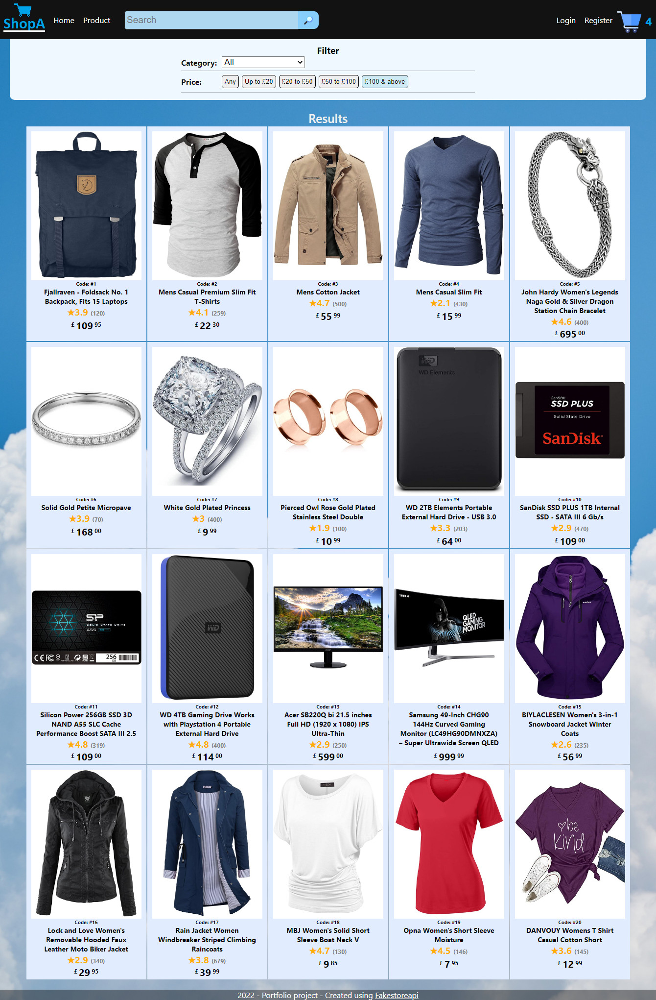

## React shopping app

As my first react project I decided to build a shopping app.
I am not that great at the design, so you will have to excuse me for that.

### Pages
- It has a home page that gets a list of categories from database.
- A product page that gets a list of products from database.
- A search that displays products based on the searched key.
- A login page that checks database for the user informations or if the user exists and returns a token.
- A register page where user can create their account that will be saved in the database.
- A basket page that displayes added items. (No functionality for checkout)

### Technologies
- For the design part I used react ability to use components to break different things into smaller parts.
- In order to make the page responsive I made sure to design for mobile first, I then used media quaries and js to make it work on different sizes displays.
- For a backend I have used epress JS to create a local server.
- For the database I used MySQL.

### Features 
- For simplicity reasons the images are random generated but the functionality for downloading images from database (base 64 format) is implemented.
- For the registration, I encrypted the password using hash.
- For the login I implemented access token that expires after sometime. (Better secret needs to be implemented for security).

### Overview 
- As this was my first react project I learned a lot about this framework, I saw its adventages but also some of its disadvantages. However, there is still a lot that could be improved and added. 
- After combining all the differnt aspects I coded I think I created a neat little website, although the design part could have been a little better.
